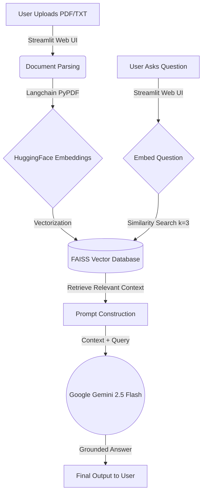

# 🏢 Enterprise RAG Knowledge Assistant

[](https://llm-rag-system.streamlit.app/)

## 📖 Overview
This project is a production-grade **Retrieval-Augmented Generation (RAG)** application built to allow users to dynamically query custom documents using cutting-edge Generative AI. It represents a highly optimized, enterprise-level approach to AI information retrieval, operating entirely on a zero-cost infrastructure stack.

Instead of relying on an LLM's pre-trained (and potentially hallucinated) knowledge, this system extracts grounded facts directly from user-uploaded PDFs and Text files in real-time, feeding that exact context to the LLM to generate highly accurate, domain-specific answers.

---

## 🏗 System Architecture

The application utilizes a modular, decoupled architecture separating the frontend ingestion layer from the vector processing layer and the LLM generation layer.



### ⚙️ How It Works (Under the Hood)
1. **Dynamic Ingestion:** When a user uploads a document, the system temporarily caches it in memory and utilizes Langchain to parse the raw text.
2. **Semantic Vectorization:** The textual data is immediately passed through the open-source HuggingFace `all-MiniLM-L6-v2` transformer model. This converts human-readable sentences into high-dimensional mathematical vectors.
3. **In-Memory Indexing:** The vectors are stored in a highly optimized FAISS (Facebook AI Similarity Search) index for lightning-fast retrieval. 
4. **Contextual Retrieval:** When the user queries the system, the query is vectorized and mathematically compared against the FAISS index to find the most conceptually similar document chunks.
5. **Augmented Generation:** The closest matching paragraphs are extracted and injected into a strict prompt template, which is sent to Google's **Gemini 2.5 Flash** model to formulate a final, human-readable answer.

---

## 🔒 Data Privacy & Security
**Zero Data Retention:** This application utilizes stateless *Ephemeral In-Memory Storage*. 
- Uploaded user files are staged sequentially in RAM.
- The moment the document is successfully chunked and vectorized, the raw file is permanently deleted from the host server (`os.remove()`).
- Vector databases are tied strictly to the browser session and are wiped instantly upon session termination. No user data is retained, making this architecture heavily privacy-compliant.

---

## 🛠 Tech Stack
* **Frontend:** Streamlit
* **Orchestration:** Langchain
* **Embeddings:** HuggingFace (`sentence-transformers`)
* **Vector Database:** FAISS CPU (Facebook AI Similarity Search)
* **LLM Engine:** Google Generative AI (Gemini 2.5 Flash)
* **Deployment:** Streamlit Community Cloud

---

## 💻 Local Installation Guide

If you wish to run this application locally on your own machine:

1. **Clone the repository**
   ```bash
   git clone https://github.com/IreneYPCheung/LLM-RAG-System-Portfolio.git
   cd LLM-RAG-System-Portfolio
   ```

2. **Set up a Virtual Environment**
   ```bash
   python -m venv venv
   source venv/bin/activate  # On Windows use `venv\Scripts\activate`
   ```

3. **Install Dependencies**
   ```bash
   pip install -r requirements.txt
   ```

4. **Configure Environment Variables**
   - Create a file named `.env` in the root directory.
   - Add your Google AI Studio API key to the file:
     ```env
     GEMINI_API_KEY="your_actual_api_key_here"
     ```

5. **Run the Application**
   ```bash
   streamlit run app.py
   ```
